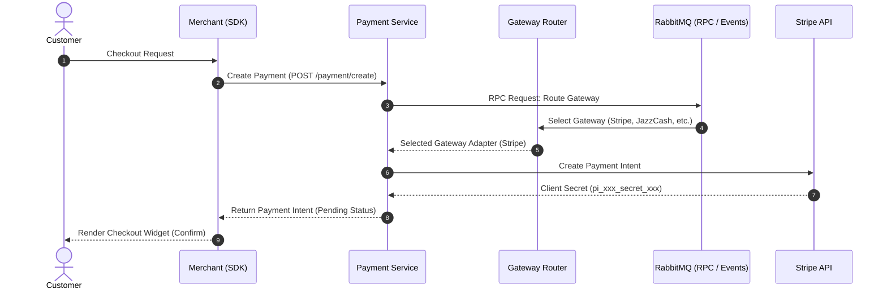

# 💳 Payment Platform – Microservices Monorepo

**A scalable, multi-tenant payment platform built with an event-driven microservices architecture.**  
Built with **Node.js**, **Express**, **MongoDB**, and **RabbitMQ** — this monorepo is designed to handle decentralized payments, merchant management, subscriptions, payouts, and webhook processing securely and reliably.

---

## 🚀 What Does This Platform Do?

This system serves as a complete multi-tenant payment infrastructure offering:

- ✅ **Merchant & Tenant Management**: Tenant isolation with custom configurations and secure API key provisioning.
- 🛒 **Multi-Gateway Payments**: Dynamic routing of transactions to multiple global and regional providers.
- 🔄 **Subscriptions & Recurring Billing**: Plan configuration with flexible billing cycles, trials, pause/resume, and cancellation.
- 💸 **Payouts & Refunds**: Managed refund workflows and payouts to connected merchant bank/payout accounts.
- 📤 **Webhook Processing**: Validates incoming gateway webhooks and dispatches custom webhooks to registered merchant endpoints with HMAC signature security.
- 📦 **Event-Driven Architecture**: Decoupled, high-throughput service communication using RabbitMQ (Events & RPC).
- 🔒 **Security & Idempotency**: Strict JWT token authentication and distributed idempotency middleware to guarantee safe, single-execution processing.

---

## 🔧 Architecture & Monorepo Structure

The repository is structured as a Monorepo to keep code co-located while enforcing strict boundaries between runtime environments:

```
├── apps/services/       # 12 Independent Microservices
├── packages/            # Shared Library Packages
│   ├── event-bus/       # RabbitMQ Event Pub/Sub & RPC Client/Server
│   ├── gateway/         # Gateway Abstraction Layer and Adapters
│   └── idempotency/     # Middleware preventing duplicate requests
├── sdk/                 # Developer Node.js SDK
├── docs/                # Comprehensive Integration & Setup Docs
└── postman_collection/  # API testing collections
```

### 1. Core Microservices (`/services`)

The platform is split into the following 12 key microservices:

| Service | Description |
|---------|-------------|
| **`auth-service`** | JWT-based user authentication, role management, and session control. |
| **`merchant-service`** | Manages merchant onboarding, profiles, API keys, and configurations. |
| **`payment-service`** | Initiates and tracks transaction lifecycles; coordinates state updates. |
| **`gateway-router-service`** | Evaluates rules to route payment intents to the optimal provider. |
| **`stripe-service`** | Gateway adapter dedicated to Stripe API config and token generation. |
| **`subscription-service`** | Tracks billing states, active subscriptions, trials, and invoices. |
| **`refund-service`** | Performs full/partial refunds and triggers ledger/gateway updates. |
| **`payout-service`** | Handles distributions and payouts to merchant bank/connected accounts. |
| **`transaction-service`** | Central ledger capturing all debit/credit activities across the platform. |
| **`incoming-webhook-service`** | Receives and validates raw webhooks sent by external payment providers. |
| **`merchant-webhook-service`** | Dispatches HTTP payloads and HMAC signatures to merchant webhook endpoints. |
| **`developer-portal-service`** | Interactive OpenAPI 3.1 Swagger UI documentation portal. |

### 2. Shared Packages (`/packages`)

To prevent code duplication, reusable modules are extracted into shared packages:

*   **`event-bus`**: Abstracted wrapper for RabbitMQ. Handles publishing events, subscribing to queues, and executing synchronous RPC requests across services.
*   **`gateway`**: Extensible multi-gateway interface. Ships with native adapter support for:
    *   🌎 **Global Gateways**: Stripe, PayPal
    *   🇵🇰 **Regional Gateways**: JazzCash, EasyPaisa
*   **`idempotency`**: Redis-backed middleware that guarantees requests containing an `Idempotency-Key` header are executed exactly once.

### 3. Developer SDK (`/sdk`)

A production-ready **Node.js SDK** is included inside `/sdk` to simplify integration for merchants:
*   Wrappers for payments, subscriptions, payouts, refunds, and merchant management.
*   Built-in utility (`sdk.webhook.verifySignature`) for one-line webhook HMAC signature verification.
*   Standardized errors (`GatewayError`, `ValidationError`, etc.) and full TypeScript definitions (`index.d.ts`).

---

## 💡 How It Works (Example Lifecycle)



1. **Transaction Lifecycle**: The core services publish events (e.g. `payment.created`, `refund.succeeded`) or request RPC actions (e.g. fetching merchant details) over RabbitMQ.
2. **Asynchronous Handshake**: Once a gateway successfully captures a payment, it fires a webhook to `incoming-webhook-service`. This service validates the provider's signature, publishes a message to RabbitMQ, and updates the payment/ledger states asynchronously.
3. **Dispatch to Merchant**: The `merchant-webhook-service` picks up the successful status changes and dispatches signed events back to the merchant's configured endpoint.

---

## 📚 Documentation Reference

For deep-dive documentation on specific aspects of the system, reference these files:

*   📖 [Quick Start Guide](file:///d:/OpenSource%20Backends/Payment%20Microservice/docs/QUICK_START.md): Step-by-step setup for local environment.
*   🔌 [Integration Guides](file:///d:/OpenSource%20Backends/Payment%20Microservice/docs/INTEGRATION_GUIDES.md): Details on configuring Stripe, Paypal, and regional providers.
*   🧪 [Sandbox Mode & Mocks](file:///d:/OpenSource%20Backends/Payment%20Microservice/docs/SANDBOX.md): How to perform mock transactions and run E2E assertions.
*   🎯 [Production Readiness checklist](file:///d:/OpenSource%20Backends/Payment%20Microservice/docs/production-readiness.md): Security checklist, TLS settings, and scaling parameters.
*   📜 [Changelog](file:///d:/OpenSource%20Backends/Payment%20Microservice/docs/CHANGELOG.md): History of features, fixes, and architectural upgrades.

---

## 🛠️ Quick Start & Running Tests

### 1. Run all microservices
Ensure **MongoDB** and **RabbitMQ** are running, then initialize all microservices concurrently:

```bash
# Install root dependencies
npm install

# Start the orchestration runner
node run_services.js
```

### 2. Execute End-to-End Integration Flow
To verify that all services, RabbitMQ RPCs, database connections, and mock webhooks are functioning correctly:

```bash
# Runs the E2E script simulating full payment + webhook capture + refund flow
node test_flow.js
```

The script will seed a Stripe configuration, create a payment intent, simulate a success webhook, check the ledger status, initiate a partial refund, trigger a refund webhook, and verify final payment state.
